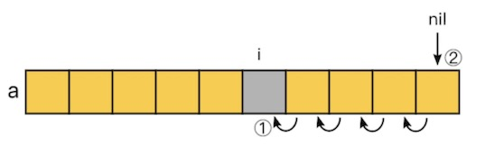

# 数据结构

## array & slice

### slice底层的实现原理？

切片（slice）通过数组指针、长度（len）和容量（cap）3个字段的设计，实现了类似动态数组的功能。但是它本身并非动态数组，而是通过内部指针引用底层数组，所以在赋值、函数传参时，不会涉及到底层数组的数据拷贝。因为复制 `slice` 的代价很小（1个指针，2个int变量），通常在函数传参时参数类型使用T而不是 \*T（指针）：

```go
type slice struct {  
   array unsafe.Pointer  
   len   int  
   cap   int  
}
```

切片为我们封装了快速访问底层数组的能力，我们可以使用 `索引下标` 访问或更新底层数组中元素的值，切片会自动计算底层数组的地址偏移：

```go
var arr = [3]int{0, 1, 2}  
s := arr[1:]  // 使用arr底层数组
s[0] = 3      // 底层数组的偏移地址 = arr[1]，切片进行了转换
fmt.Println(arr)  // 0 3 2
fmt.Println(s)    // 3 2
```

也可以使用 `索引区间` 访问数组或者其他切片中的某一部分数据，因为是基于数组指针的操作，所以不会有内存的拷贝：

```go
var arr = [5]int{0, 1, 2, 3, 4}  
s1 := arr[:3] // 0,1,2 基于数组创建切片  
s2 := s1[:1]  // 0,1   基于切片创建切片(reslice)  
  
fmt.Println((*reflect.SliceHeader)(unsafe.Pointer(&s1))) // &{824634957824 3 5}  
fmt.Println((*reflect.SliceHeader)(unsafe.Pointer(&s2))) // &{824634957824 1 5}
```

当追加元素底层数组容量不足时，切片还会自动 `创建新的底层数组`，实现动态扩容的功能：

```go
var s1 = []int{1, 2} // 注意：不指定长度是创建的切片  
fmt.Println((*reflect.SliceHeader)(unsafe.Pointer(&s1))) // &{824634400800 2 2}

s2 := append(s1, 3, 4)  
fmt.Println((*reflect.SliceHeader)(unsafe.Pointer(&s2))) // &{824634466336 4 4}
```

### 数组和切片有什么区别？

- 数组是静态的，在编译期就确定了长度，切片可在运行期动态改变长度，但是切片的底层还是基于数组实现，只不过额外封装了动态扩容的功能
- 可基于数组创建切片，反之不行
- Go中的数组是 `值类型`（和其他语言不同），在栈上分配；而切片是引用类型，在堆上分配且必须使用 `make` 初始化（`字面量`是语法糖，也是使用make初始化的）。

> [牛客网的网友](https://www.nowcoder.com/questionTerminal/11e7d34b84e14e269eaa558a8d39a93c?)  
golang中分为值类型和引用类型  
值类型分别有：int系列、float系列、bool、string、数组和结构体  
引用类型有：指针、slice切片、管道channel、接口interface、map、函数等  
值类型的特点是：变量直接存储值，内存通常在栈中分配  
引用类型的特点是：变量存储的是一个地址，这个地址对应的空间里才是真正存储的值，内存通常在堆中分配  

- 数组的长度是类型的一部分，长度不同的数组类型也是不一样的，而切片的长度不是类型的组成部分

```go
func arrayType() {  
   var arr1 [2]int  
   var arr2 [3]int  
  
   contains(arr1, 1)  
   contains(arr2, 1) // 报错：Cannot use 'arr2' (type [3]int) as the type [2]int
}

func contains(arr [2]int, num int) bool { }
```

- 函数传参数时，如果传递数组则每次都会进行拷贝，但是切片只会拷贝底层数组指针，所以切片使用起来更高效也更方便。

### 切片是怎样扩容的？

切片扩容发生在调用 `append()` 时，如果切片的底层数组长度已经不足以容纳新添加的元素时，就会触发扩容，此时go编译器会调用 `growslice()` 确定新的容量大小，然后拷贝老的元素到新的底层数组。

扩容策略自 [runtime: make slice growth formula a bit smoother](https://go.googlesource.com/go/+/2dda92ff6f9f07eeb110ecbf0fc2d7a0ddd27f9d)提交后有一些改变，这个提交自`Go1.18`后生效，主要有2处优化：2倍扩容由1024改成256，超过之后固定1.25倍扩容改成了表达式计算，使扩容下降的更平滑。

`Go1.17`扩容实现：

```go
// go.17 src/runtime/slice.go
func growslice(et *_type, old slice, cap int) slice {
	newcap := old.cap
	doublecap := newcap + newcap
	// 1.新容量计算
	if cap > doublecap {
		newcap = cap
	} else {
		if old.cap < 1024 {
			newcap = doublecap
		} else {
			for 0 < newcap && newcap < cap {
				newcap += newcap / 4 
			}
			if newcap <= 0 {
				newcap = cap
			}
		}
	}
	// ...
	// 2.内存对齐计算，最终的的容量会大于等于上面的 newcap
	var overflow bool
	var lenmem, newlenmem, capmem uintptr
	switch {
	case et.size == 1:
		// ...
	case et.size == sys.PtrSize:
		lenmem = uintptr(old.len) * sys.PtrSize
		newlenmem = uintptr(cap) * sys.PtrSize
		capmem = roundupsize(uintptr(newcap) * sys.PtrSize)
		overflow = uintptr(newcap) > maxAlloc/sys.PtrSize
		newcap = int(capmem / sys.PtrSize)
	case isPowerOfTwo(et.size):
		// ...
	default:
		// ...
	}
	//...
	memmove(p, old.array, lenmem)
	return slice{p, old.len, newcap}
}
```

- 新容量计算
	- 如果期望大小超过现有容量2倍，则直接使用期望容量
	- 如果容量小于1024（`Go1.18后是256`），2倍扩容，否则1.25倍扩容（`Go1.18后由表达式计算`）
- 最终容量计算：为了避免内存碎片，最后会进行 `内存对齐计算`，所以最后的结果会大于等于上面计算的值。

`roundupsize` 函数用来计算内存对齐后最终的容量值，实际上就是根据所需内存大小进行向上取整，然后使用数组 `class_to_size` 中的整数以提供内存分配效率并减少内存碎片：

```go
var class_to_size = [_NumSizeClasses]uint16{0, 8, 16, 24, 32, 48, 64, ...}
var size_to_class8 = [smallSizeMax/smallSizeDiv + 1]uint8{0, 1, 2, 3, 4, 5, 5, ...}

func roundupsize(size uintptr) uintptr {
	if size < _MaxSmallSize {       // 32768
		if size <= smallSizeMax-8 { // 1024
			return uintptr(class_to_size[size_to_class8[divRoundUp(size, smallSizeDiv)]])
		} else {
			return uintptr(class_to_size[size_to_class128[divRoundUp(size-smallSizeMax, largeSizeDiv)]])
		}
	} 
	// ...
}
```

下面是这个数组预定义的内存大小（class是size_to_class8计算的索引，bytes/obj是class_to_size中存放的整数）：

```bash
// class  bytes/obj  bytes/span  objects  tail waste  max waste  min align  
//     1          8        8192     1024           0     87.50%          8  
//     2         16        8192      512           0     43.75%         16  
//     3         24        8192      341           8     29.24%          8  
//     4         32        8192      256           0     21.88%         32  
//     5         48        8192      170          32     31.52%         16  
//    ... 
//    67      32768       32768        1           0     12.50%       8192
```

我们来看一个实例：

```go
var s []int                    // len: 0 cap: 0

s = append(s, 1, 2)  
fmt.Println(s, len(s), cap(s)) // len: 2 cap: 2

s = append(s, 3, 4, 5)  
fmt.Println(s, len(s), cap(s)) // len: 5 cap: 6

s = append(s, 6, 7)  
fmt.Println(s, len(s), cap(s)) // len: 6 cap: 12
```

1. nil切片 `s` 的 `len` 和 `cap` 都为0
2. 当添加元素 `1,2` 时，期望容量是2，当前容量是0，满足 `cap > doublecap` 条件，故新容量为2。然后进行内存对齐计算，int在64位占8字节，于是需要2\*6=16字节的内存，查上表Go可分配该大小，于是 `cap` 最终为2。
3. 当添加元素 `3,4,5` 时，也满足期望容量超过2倍当前容量的条件（cap > doublecap），于是初步计算出新容量为5。此时需要内存大小为5\*8=40，为了减少内存碎片以及提高分配效率，进行内存对齐计算后向上取整得到48，48/8=6个元素，于是 `cap` 最终为6。
4. 当添加元素 `6,7` 时，旧容量小于1024（`G1.18后要小于256`），于是2倍扩容得到12，12\*8=96满足内存分配要求，故最终 `cap` 为12。

最后，自 `Go1.18` 开始，超过256扩容大小改成了表达式计算，不再是固定的1.25倍（1.25倍 < growth factor < 2倍）：

```go
// go1.18 src/runtime/slice.go
func growslice(et *_type, old slice, cap int) slice {
	// ...
	newcap := old.cap
	doublecap := newcap + newcap
	if cap > doublecap {
		newcap = cap
	} else {
		const threshold = 256 // 之前是1024
		if old.cap < threshold {
			newcap = doublecap
		} else {
			for 0 < newcap && newcap < cap {
				// Transition from growing 2x for small slices
				// to growing 1.25x for large slices. This formula
				// gives a smooth-ish transition between the two.
				newcap += (newcap + 3*threshold) / 4
			}
			if newcap <= 0 {
				newcap = cap
			}
		}
	}
	//...
}
```

引入该表达式后，扩容会更加平滑， Keith Randall 大神提交的描述给出了一个示例（growth factor越来越小）：

```bash
runtime: make slice growth formula a bit smoother

Instead of growing 2x for < 1024 elements and 1.25x for >= 1024 elements,
use a somewhat smoother formula for the growth factor. Start reducing
the growth factor after 256 elements, but slowly.

starting cap    growth factor
256             2.0
512             1.63
1024            1.44
2048            1.35
4096            1.30
```

### nil切片和空切片底层数组指向的地址一样吗？

不一样，nil切片的底层数组指针也是nil，而长度为0的空切片的底层数组指针是有地址的，指向一个特殊的全局变量 `runtime.zerobase` 的地址(uintptr类型)。


上图的测试代码：
```go
func main() {  
   var s1 []int            // nil 切片
   s2 := make([]int, 0)    // 空切片，长度和cap都是0
   s3 := make([]int, 0)    // 同样是空切片
  
   fmt.Println((*reflect.SliceHeader)(unsafe.Pointer(&s1)))  
   fmt.Println((*reflect.SliceHeader)(unsafe.Pointer(&s2)))  
   fmt.Println((*reflect.SliceHeader)(unsafe.Pointer(&s3)))  
}
```

输出：

```bash
&{0 0 0}
&{18280512 0 0}
&{18280512 0 0}
```

从slice源码中，我们可以看到空切片的底层数组指针指向了全局变量 zerobase 的地址：

```go
// ------ runtime/slice.go

func makeslice(et *_type, len, cap int) unsafe.Pointer {  
   mem, overflow := math.MulUintptr(et.size, uintptr(cap))  
   if overflow || mem > maxAlloc || len < 0 || len > cap {  
      if overflow || mem > maxAlloc || len < 0 {  
         panicmakeslicelen()  
      }  
      panicmakeslicecap()  
   }  
   // mem是0，故 malloccgc直接返回来 zerobase 的地址
   return mallocgc(mem, et, true)  
}

// ------ runtime/malloc.go

// base address for all 0-byte allocations  
var zerobase uintptr

func mallocgc(size uintptr, typ *_type, needzero bool) unsafe.Pointer {  
   // ...
   if size == 0 {  
      return unsafe.Pointer(&zerobase)  
   }
   // ...
}
```

### 拷⻉⼤切⽚⼀定⽐⼩切⽚代价⼤吗？

代价是一样的，当把一个 slice 变量复制给另外一个变量时，只需要拷贝一个底层数组的指针和2个int值（长度和容量），所以拷贝的代价和底层数组大小无关，这也就是所谓的浅拷贝。

go源码中切片的定义如下(runtime/slice.go)：
```go
type slice struct {  
   array unsafe.Pointer  
   len   int  
   cap   int  
}
```

默认是不导出的，如果我们要访问一个 slice 底层的这些结构，我们可以使用 `reflect` 包下的 `SliceHeader` 结构。

```go
package reflect

type SliceHeader struct {  
   Data uintptr  
   Len  int  
   Cap  int  
}
```

测试：

```go
func main() {  
   var s1 = []int{1, 2, 3}  
   s2 := (*reflect.SliceHeader)(unsafe.Pointer(&s1))  
   fmt.Printf("%v\n底层数组地址: %d, Len: %d, Cap: %d", s2, s2.Data, s2.Len, s2.Cap)  
}
```

输出：

```bash
&{824633876744 3 3}
底层数组地址: 824633876744, Len: 3, Cap: 3
```

### 实际项目中使用slice都遇到过什么坑？

1. 设置合理的初始化大小，避免不必要的扩容
2. for range遍历切片时，如果要更改元素的值，请注意value是元素的拷贝，当切片中元素的类型是值类型时，对它的更改不会影响切片中的元素

```go
import "fmt"

type MyNum struct {
	num int
}

func main() {
	data := []int{1, 2, 3}
	// 错误：v是元素的拷贝，int是值类型，对其的更改不会影响切片中的元素
	for _, v := range data { 
		v *= 10                 // original item is not changed
	}
	fmt.Println("data:", data)  // [1 2 3]

    // 正确：使用索引更新元素值
	for i := range data { 
		data[i] *= 10
	}
	fmt.Println("data:", data)  // [10 20 30]

    // 正确：v拷贝的是指针，v.num 和 nums[i].num 指向的是同一块内存，故赋值操作有效
    nums := []*MyNum{{1}, {2}, {3}}
    for _, v := range nums {
        v.num *= 10
    }

    fmt.Println(nums[0], nums[1], nums[2]) // &{10} &{20} &{30}
}
```

3. 使用 `copy()` 避免切片污染

```go
var arr = [5]int{0, 1, 2, 3, 4}  
s1 := arr[:3] // 0,1,2 基于数组创建切片  
s2 := s1[:1]  // 0,1   基于切片创建切片(reslice)  
s2[0] = 9  
fmt.Println(s1,s2)  // [9 1 2] [9]

var arr = [5]int{0, 1, 2, 3, 4}  
var s3 = make([]int, 1)  
copy(s3, arr[:1])  
s3[0] = 10  
fmt.Println(arr, s3) // [0, 1, 2, 3, 4] [10]
```

4. slice的内存泄漏问题（[来源：Go 语言高性能编程-大量内存得不到释放](https://geektutu.com/post/hpg-slice.html#3-1-%E5%A4%A7%E9%87%8F%E5%86%85%E5%AD%98%E5%BE%97%E4%B8%8D%E5%88%B0%E9%87%8A%E6%94%BE)）
在已有切片的基础上进行切片（`reslice`），不会创建新的底层数组。因为原来的底层数组没有发生变化，内存会一直占用，直到没有变量引用该数组。因此很可能出现这么一种情况，原切片由大量的元素构成，但是我们在原切片的基础上切片，虽然只使用了很小一段，但底层数组在内存中仍然占据了大量空间，得不到释放。比较推荐的做法，使用 `copy` 替代 `re-slice`。

```go
// bad
func lastNumsBySlice(origin []int) []int {  
	return origin[len(origin)-2:]  
}  

// good
func lastNumsByCopy(origin []int) []int {  
	result := make([]int, 2)  
	copy(result, origin[len(origin)-2:])  
	return result  
}
```

### 切片的性能优化

1. 删除元素时，把空余位置置空，有助于垃圾回收

**情况1**：很小一部分不再使用（少见）
如 [Go 语言高性能编程-Delete(GC)](https://geektutu.com/post/hpg-slice.html#2-4-Delete-GC)中给出了一段示例代码：
```go
maxLen := len(a)
if i < maxLen - 1{
	copy(a[i:], a[i+1:]) // i+1到结尾的元素统一往前移动一格
}
a[maxLen-1] = nil // or the zero value of T
a = a[:maxLen-1]  // 最后一格切掉
```


实际项目中，因为**数组的删除时间复杂度是 O(n)** ，如果遇到要频繁删除的场景，更好的解决方案是更换数据结构，比如 双向链表 `list.List` ，所以这个场景以了解为主。

**情况2**：长时间只使用切片数组中很小的片段
那么建议新建独立切片，复制需要的数据，使得原数组内存能被及时回收，降低内存占用。

2. 一次性分配足够的内存，避免动态扩容：老生常谈，不在赘述

### 字面量和make初始化切片有区别吗？

有，当我们使用字面量（`[]int{1,2,3}`）创建切片时，会被编译器在编译期间展开成如下所示的代码片段：

```go
var s [3]int
s[0] = 1
s[1] = 2
s[2] = 3
var vauto *[3]int = new([3]int) // 初始化一个数组指针
*vauto = s
slice := vauto[:]
```

汇编输出：

```go
$ go build main.go && go tool objdump ./main | grep "main.go:4" 

493b6610                CMPQ 0x10(R14), SP                      
0f8685000000            JBE 0x108d96f                           
4883ec40                sUBQ $0x40, SP                          
48896c2438              MOVQ BP, 0x38(SP)                       
488d6c2438              LEAQ 0x38(SP), BP                       
488d05e1870000          LEAQ runtime.rodata+34368(SB), AX       
90                      NOPL                                    
e8dbe4f7ff              CALL runtime.newobject(SB)              
48c70001000000          MOVQ $0x1, 0(AX)                        
48c7400802000000        MOVQ $0x2, 0x8(AX)                      
48c7401003000000        MOVQ $0x3, 0x10(AX)                     
440f117c2428            MOVUPS X15, 0x28(SP)                    
bb03000000              MOVL $0x3, BX                           
4889d9                  MOVQ BX, CX                             
e8d1bef7ff              CALL runtime.convTslice(SB)             
488d0dea690000          LEAQ runtime.rodata+26752(SB), CX       
48894c2428              MOVQ CX, 0x28(SP)                       
4889442430              MOVQ AX, 0x30(SP)                       
488b6c2438              MOVQ 0x38(SP), BP                       
4883c440                ADDQ $0x40, SP                          
c3                      RET                                     
e8acddfcff              CALL runtime.morestack_noctxt.abi0(SB)  
e967ffffff              JMP main.main(SB) 
```

## map

## 字符串

## 参考资料

- [golangFamily](https://github.com/xiaobaiTech/golangFamily)
- [go语言面试题](https://www.topgoer.cn/docs/gomianshiti/mianshiti)
- [常问面试题汇总](https://www.topgoer.cn/docs/interview/interview-1dks7os61lo44)
- [Golang修养之路](https://www.topgoer.cn/docs/golangxiuyang/golangxiuyang-1cmedvjjav3f0)
- [Go 程序员面试笔试宝典](https://github.com/golang-design/Go-Questions)
- [Golang slice 从源码来理解](https://learnku.com/articles/33918)
- [go slice append](https://www.jianshu.com/p/ac114b58d201)
- [Go slices capacity increase rate](https://stackoverflow.com/questions/75348572/go-slices-capacity-increase-rate)
- [50 Shades of Go: Traps, Gotchas, and Common Mistakes for New Golang Devs](http://devs.cloudimmunity.com/gotchas-and-common-mistakes-in-go-golang/)
- [Go 语言高性能编程](https://geektutu.com/post/high-performance-go.html)
- [详解Go slice底层原理](https://juejin.cn/post/7091664218864222245)