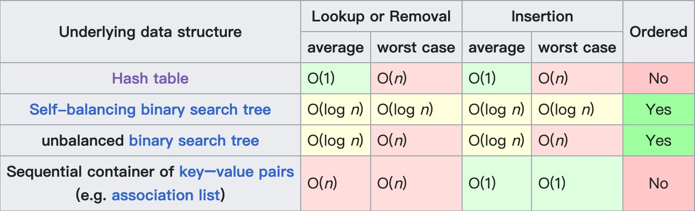
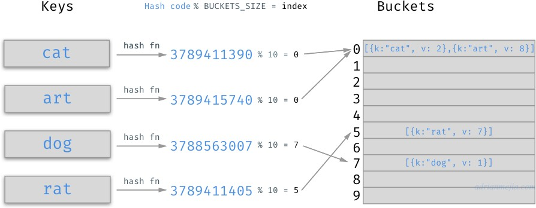
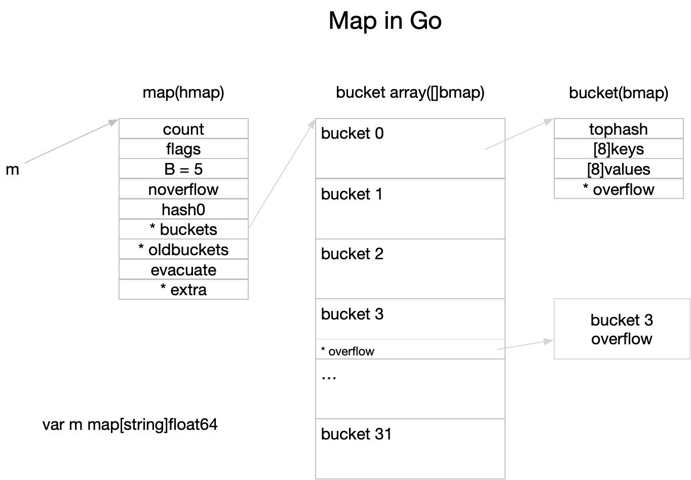
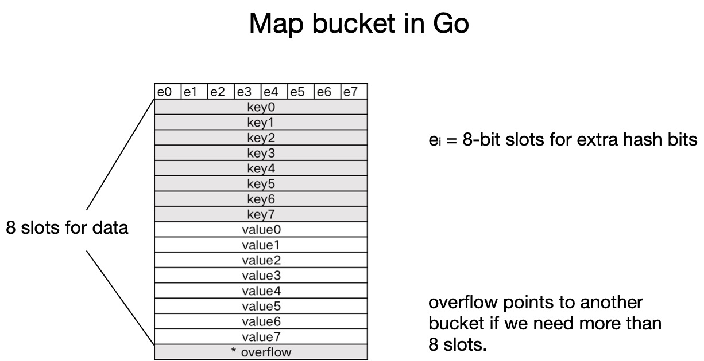

# map底层的实现原理

## map简介

[维基百科](https://en.wikipedia.org/wiki/Associative_array)中的定义如下：
> In computer science, an associative array, map, symbol table, or dictionary is an abstract data type that stores a collection of (key, value) pairs, such that each possible key appears at most once in the collection. In mathematical terms, an associative array is a function with finite domain. It supports 'lookup', 'remove', and 'insert' operations.
> 
> The dictionary problem is the classic problem of designing efficient data structures that implement associative arrays. The two major solutions to the dictionary problem are hash tables and search trees. In some cases it is also possible to solve the problem using directly addressed arrays, binary search trees, or other more specialized structures.

简单总结：map（映射）是关联数组（associative array）的别称，是一种存储了 key-value（键值对）元素的集合，同一个key只会出现一次，支持添加、移除和查找等操作。字典问题（dictionary problem）是设计一种能够具备关联数组特性的高效数据结构。解决字典问题的常用方是哈希表和搜索树。

Go 语言中的 map 主要支持如下操作：
- 构造：m := map[key]value{}
- 插入：m[k] = v
- 查找：v, ok = m[k]
- 删除：delete(m, k)
- 迭代：for k,v := range m
- 容器大小：len(m)

图解map的2种实现方法：
- `哈希表（hash tables）`：利用数组存储键和值，通过哈希函数对输入的key进行计算找到value所在的位置，它的关键在于哈希函数的选择和哈希冲突时的解决办法（Go中使用拉链法解决），最坏情况是O(n)、平均O(1)


- `搜索树（search trees）`：使用自平衡二叉查找树来查找value（C++中的map就是基于红黑树实现，面试时经常会被问到），最坏O(log n)，平均O(log n)


在Go语言中，`map 使用了哈希表实现`，主要因为哈希表优越的 O(1) 读写性能要优于自平衡搜索树 O(log n) 的性能，下图展示了几种实现方式的时间复杂度：



而在 C++ 的STL中，则同时提供了搜索树（红黑树）和哈希表的2种实现：

```c++
map<int, int> m1;           // 根据key排序，基于红黑树实现
unordered_map<int, int> m2; // 无序，基于数组+哈希函数实现
```

红黑树是一种[自平衡](https://zh.wikipedia.org/wiki/%E5%B9%B3%E8%A1%A1%E6%A0%91)的[二查找叉树](https://zh.wikipedia.org/wiki/%E4%BA%8C%E5%85%83%E6%90%9C%E5%B0%8B%E6%A8%B9)，它的特点是性能稳定，在最坏的情况下也是 O(log n）的查找时间。二叉查找树的特点是中序遍历是有序的，所以基于红黑树实现的 map 的遍历是有序的，而基于哈希表的实现则是乱序的。

`因为 Go 的 map 是基于哈希表的实现`，故下文中主要介绍基于哈希表的实现原理和重点。

## 哈希表实现的关键点

### 哈希函数

哈希函数主要是用来解决 key 到 value 的映射问题：这个key对应的value存储在哪里？

如下图中，cat 经过哈希函数计算后得到一串数字，再对10取余数，得到Bucket的位置，再遍历比较里面的元素最终得到value值：  



我们看到，这里我们使用哈希函数把字符串变成了数字，并且不同的字符串计算出来的数字不同，同一个字符串不管运行多少次，计算出的数字一定相同。利用这个特性，我们自己再做一些取余数计算，就能解决 key 到 value 的映射问题。

在理想情况下，哈希函数应该能将不同的键映射到不同的索引，这要求哈希的输出范围要大于输入范围：  


但由于键的数量会远远大于映射的范围，所以实际情况的结果会出现不均匀的情况，不同字符的hash code相同，这也就说所谓的哈希冲突问题：  


使用结果分布比较均匀的哈希函数，哈希表的增删改查时间复杂度为O(1)，如果结果分布不均匀，最坏情况下，时间复杂度可能会达到O(n)。

### 冲突解决

常用解决哈希冲突的方法是`开放寻址法`和`拉链法`。

开放寻址法的核心思想是依次探测和比较数组中的元素以判断目标键值对是否存在于哈希表中，如果存在，则把元素插入到冲突key的下一个位置，如下图 `key3` 和 `key4` 冲突时被追加到上一个key的末尾：


与开放寻址法相比，`拉链法是哈希表最常见的实现方法，大多数的编程语言都用拉链法实现哈希表`，它的实现比较开放地址法稍微复杂一些，但是平均查找的长度也比较短，各个用于存储节点的内存都是动态申请的，可以节省比较多的存储空间。

实现拉链法一般会使用`数组加上链表`，不过一些编程语言会在拉链法的哈希中引入红黑树以优化性能，桶中存放的是一个链表，当出现冲突时，在链表的最末尾进行追加。查找的时候，遍历该链表即可：


更多关于 "开放寻址法" 和 “拉链法”的介绍请参考：《Go语言设计与实现》3.3 哈希表一节。 

## 源码分析

> 《Go语言设计与实现》使用的是 go1.15 版本

### 数据结构

整体结构（参考：[GopherCon 2016: Keith Randall - Inside the Map Implementation](https://www.youtube.com/watch?v=Tl7mi9QmLns)）：


上图中，实现 map 的结构是 `runtime.hmap` ，hmap是 hashmap 的缩写：

- `count`：代表哈希表的长度
- `B`：代表桶的对数，2^B=32，故B为5
- `buckets`：是一个指针，指向一个桶数组
- `oldbuckets`：扩容时使用，指向老的桶
- `extra.overflow`：保存所有溢出桶的数组指针

```go
// /src/runtime/map.go  

type hmap struct {   
   count     int // 元素个数，调用 len(map) 时，直接返回此值
   flags     uint8  
   B         uint8  // 桶的对数，len(buckets) == 2^B 
   noverflow uint16 // 溢出桶的近似数量
   hash0     uint32 // 哈希种子，让哈希函数的结果具有随机性，计算key时用到

   // 指向 buckets 数组，大小为 2^B，如果元素个数为0，就为 nil 
   buckets    unsafe.Pointer
   // 扩容时用于保存之前 buckets 的字段，它的大小是当前 buckets 的一半；
   oldbuckets unsafe.Pointer
   // 指示扩容进度，小于此地址的 buckets 迁移完成
   nevacuate  uintptr
  
   extra *mapextra  // optional fields  
}

// mapextra holds fields that are not present on all maps.type 
type mapextra struct {  
   // If both key and elem do not contain pointers and are inline, then we mark bucket  
   // type as containing no pointers. This avoids scanning such maps.  
   // However, bmap.overflow is a pointer. In order to keep overflow buckets   
   // alive, we store pointers to all overflow buckets in hmap.extra.overflow and hmap.extra.oldoverflow.   
   // overflow and oldoverflow are only used if key and elem do not contain pointers.   
   // overflow contains overflow buckets for hmap.buckets.  
   // oldoverflow contains overflow buckets for hmap.oldbuckets.  
   // The indirection allows to store a pointer to the slice in hiter.  
   overflow    *[]*bmap  
   oldoverflow *[]*bmap  
  
   // nextOverflow holds a pointer to a free overflow bucket.  
   nextOverflow *bmap  
}
```

bucket （我们常说的桶）的内存结构如下图：


实现该结构的是` runtime.bmap`：

```go
// /src/runtime/map.go
type bmap struct {  
	tophash [8]uint8

    // 如下内容由编译器补全，源码：
    // 1.15：/src/cmd/compile/internal/gc/reflect.go:bmap()
    // 1.20：/src/cmd/compile/internal/reflectdata/reflect.go:MapBucketType()
	keys [8]keytype
	values [8]valuetype
	overflow unsafe.Pointer
}
```

- `tophash`：哈希键的高8位，通过位运算代替取余，加速定位 key 在桶数组的那个位置   
- `keys`：键数组，最多存储8个键，溢出时在 `overflow` 中动态分配
- `values`：值数组，同上
- `overflow`：哈希冲突单个桶存储的数据超过8个时，动态分配1个桶，如果仍然溢出，无限套娃再分配

### 哈希函数

哈希种子由 `fastrand()` 函数生成，但是哈希函数的实现却是由 runtime 进行注入的：

```go
type maptype struct {  
   typ    _type  
   key    *_type  
   elem   *_type  
   bucket *_type // internal type representing a hash bucket  
   // function for hashing keys (ptr to key, seed) -> hash  
   hasher     func(unsafe.Pointer, uintptr) uintptr  
   keysize    uint8  // size of key slot   elemsize   uint8  // size of elem slot   bucketsize uint16 // size of bucket  
   flags      uint32  
}

// v := map[k]
func mapaccess1(t *maptype, h *hmap, key unsafe.Pointer) unsafe.Pointer {  
   // ...
   hash := t.hasher(key, uintptr(h.hash0))  
   //... 
}
```

那么 `hasher` 的实现在哪里呢？根据这篇文章 [Hacking Go's Runtime with Generics](https://www.dolthub.com/blog/2022-12-19-maphash/) ，go 自 1.19 以后增加了 `hash/maphash` 包，可以使我们自定义的数据结构来使用 runtime 内置的哈希函数。

它的使用如下（[来源](https://pkg.go.dev/hash/maphash))：

```go
package main  
  
import (  
   "fmt"  
   "hash/maphash"
)  
  
func main() {  
   // The zero Hash value is valid and ready to use; setting an  
   // initial seed is not necessary.   
   var h maphash.Hash  
  
   // Add a string to the hash, and print the current hash value.  
   h.WriteString("hello, ")  
   fmt.Printf("%d\n", h.Sum64())  
  
   // Append additional data (in the form of a byte array).  
   h.Write([]byte{'w', 'o', 'r', 'l', 'd'})  
   fmt.Printf("%d\n", h.Sum64())  
  
   // Reset discards all data previously added to the Hash, without  
   // changing its seed.   
   h.Reset()  
  
   // Use SetSeed to create a new Hash h2 which will behave  
   // identically to h.   
   var h2 maphash.Hash  
   h2.SetSeed(h.Seed())  
  
   h.WriteString("same")  
   h2.WriteString("same")  
   fmt.Printf("%d == %d\n", h.Sum64(), h2.Sum64())  
}
```

输出：

```bash
17344016587466449485
9713887862625155765
3147414441205831844 == 3147414441205831844
```

其中 `Sum64` 的实现如下：

```go
func rthash(ptr *byte, len int, seed uint64) uint64 {  
   if len == 0 {  
      return seed  
   }  
   // The runtime hasher only works on uintptr. For 64-bit  
   // architectures, we use the hasher directly. Otherwise,   
   // we use two parallel hashers on the lower and upper 32 bits.   
   if unsafe.Sizeof(uintptr(0)) == 8 {  
      return uint64(runtime_memhash(unsafe.Pointer(ptr), uintptr(seed), uintptr(len)))  
   }  
   lo := runtime_memhash(unsafe.Pointer(ptr), uintptr(seed), uintptr(len))  
   hi := runtime_memhash(unsafe.Pointer(ptr), uintptr(seed>>32), uintptr(len))  
   return uint64(hi)<<32 | uint64(lo)  
}  
  
//go:linkname runtime_memhash runtime.memhash  
//go:noescape  
func runtime_memhash(p unsafe.Pointer, seed, s uintptr) uintptr
```

我们看到，最终哈希函数由 `runtime_memhash` 实现，至于这个函数的实现在哪里，目前本人没有找到，待后续补充。

### 遍历过程

请参考：[https://golang.design/go-questions/map/range/](https://golang.design/go-questions/map/range/)

### 赋值过程

请参考：[https://golang.design/go-questions/map/assign/](https://golang.design/go-questions/map/assign/)

### 删除过程

请参考：[https://golang.design/go-questions/map/delete/](https://golang.design/go-questions/map/delete/)

### 扩容过程

请参考：[https://golang.design/go-questions/map/delete/](https://golang.design/go-questions/map/delete/)

## 各个语言的map对比

