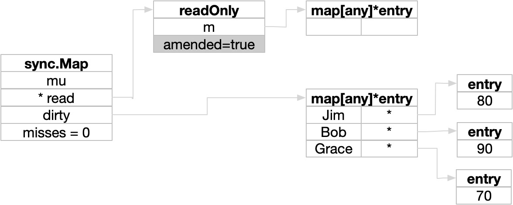
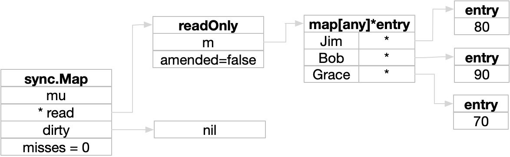
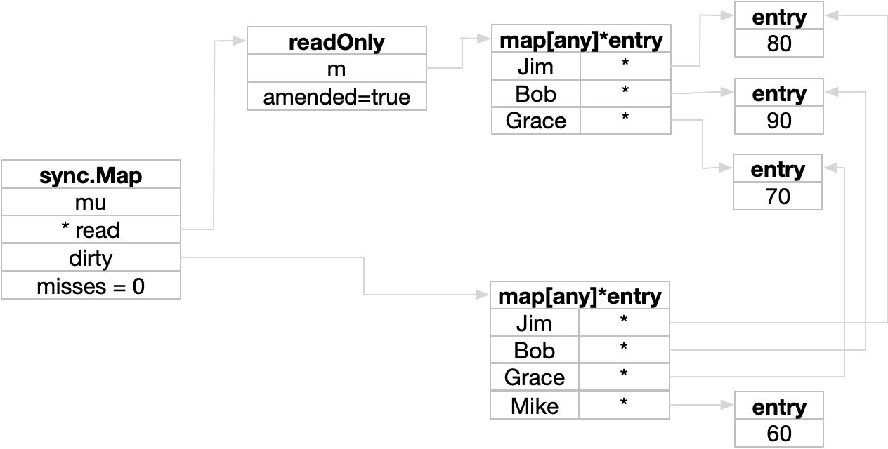
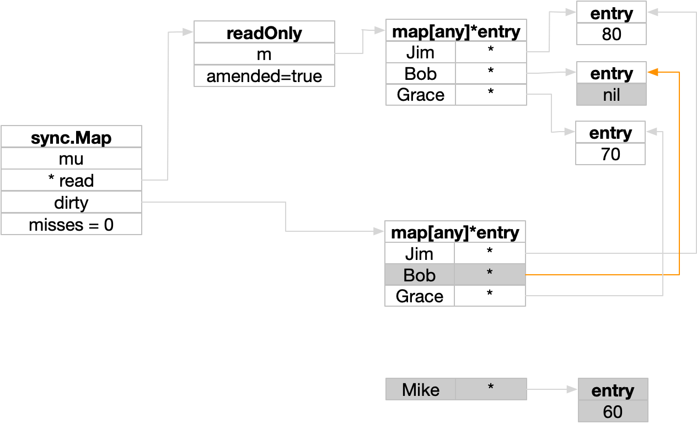
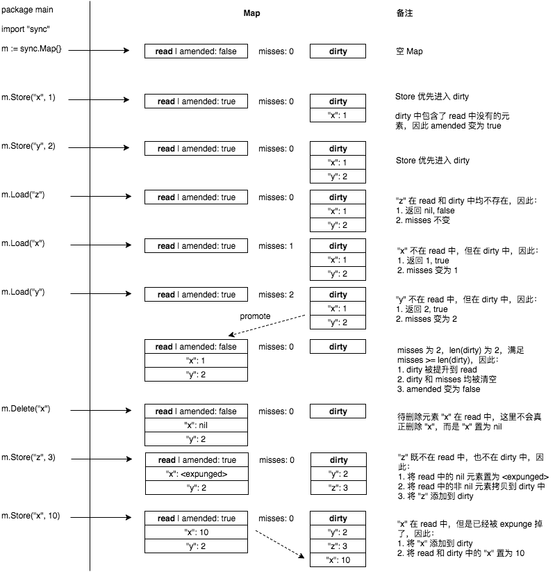

# sync.Map的实现原理

> 本节大部分内容来自于《Go专家编程》

## 简介

原生map不支持并发读写（可并发读），

## 入门

sync.Map 不需要使用 make 或字面量初始化，声明后即可直接使用，如下：

```go
var m sync.Map
```

和 map 相比，为了支持并发读写，sync.Map 在使用上和原生 map 有所区别，增删改查需要使用对应的函数，比如：

```go
m.Store("Jim", 17) // 写入  
m.Store("Bob", 20) // 写入  
m.Store("Jim", 18) // 更新 jim 的年龄  
  
age, ok := m.Load("Jim") // 查询 jim 的年龄  
fmt.Println(age, ok)  

// 删除
m.Delete("Jim")
```

遍历的时候，因为过程中可能会新增或删除元素，故需要使用 sync.Map 的 `Range` 来进行遍历：

```go
// 遍历
m.Range(func(key, value any) bool {  
   fmt.Println(key, value)  
   return true  
})  
```

另外，提供了 `LoadOrStore()` 和 `LoadAndDelete()` 函数，实现"原子"操作：

```go
// BAD
// get 和 set 非原子操作，get执行完可能刚好有一个set操作
if v,ok := m["Jim"]; !ok{ // get
	m["Jim"] = 20         // set
}

// GOOD
// 使用 LoadOrStore 代替，实现原子操作
actual, loaded := LoadOrStore("Jim", 20)  
```

完整的 sync.Map 函数如下：

```go
type mapInterface interface {  
   Load(any) (any, bool)  
   Store(key, value any)  
   LoadOrStore(key, value any) (actual any, loaded bool)  
   LoadAndDelete(key any) (value any, loaded bool)  
   Delete(any)  
   Swap(key, value any) (previous any, loaded bool)  
   CompareAndSwap(key, old, new any) (swapped bool)  
   CompareAndDelete(key, old any) (deleted bool)  
   Range(func(key, value any) (shouldContinue bool))  
}
```

## 使用要点

1）特定场景下性能能够提升
sync.Map 内部使用了两个原生 map 来实现读写分离，数据读取命中时能够提升性能，否则性能可能不如原生 map，它仅仅在读多写少的场景下才有优势。

另外，由于 sync.Map 使用2个冗余的原生 map ，它需要使用更多的内存（空间换时间），这无形中增加了 GC（垃圾回收） 的压力，因此在某些对内存大小或GC敏感的场景下应避免使用 sync.Map。

2）警惕类型安全风险
因为 sync.Map 存储值的类型为 `interface{}`，故取出时需要进行断言，否则会引发 panic：

```go
var m sync.Map  
  
m.Store("Jim", 11)     // int 类型
m.Store("Bob", "yes")  // string 类型
  
v, ok := m.Load("Bob")  
if ok {  
   // panic: interface conversion: interface {} is string, not int
   fmt.Println(v.(int))  
}
```

3）不能拷贝和传递

因为 `sync.Map` 的实现中使用了 `sync.Mutex` 互斥锁，所以不能赋值给另一个变量，也无法作为函数参数，否则可能会造成死锁或者触发 panic，故传递时（复制以及作为函数参数）只能使用指针。

## 和map对比

sync.Map 是针对特定场景的优化实现，在读多写少的情况下，读操作基本是使用原子操作实现，从而摆脱对锁的竞争，此时性能要强于原生 map 加锁（读写锁或互斥锁）方案，但写操作由于需要访问冗余的 map 并且伴随锁的竞争，性能会有所下降，即 sync.Map`适合读多写少的场景` 。

- sync.Map 采用两个冗余的数据结构（`read map` 和 `dirty map`）来实现`读写分离`
- sync.Map 仍然使用了锁，所以他不能被拷贝
- sync.Map 在查询已存在的元素时，往往能够做到无锁访问
- sync.Map 无法使用 `[]` 访问或插入元素，而是需要使用 `Load()` 和 `Store()`
- sync.Map 需要使用 `Range()` 进行遍历

## 实现原理

### 数据结构

#### sync.Map

`sync.Map` 的定义如下：

```go
// go1.20.4: /src/sync/map.go
type Map struct {  
   mu Mutex
   read atomic.Pointer[readOnly] // read 哈希表，允许并发读
   dirty map[any]*entry // dirty 哈希表，负责新数据写入
   misses int // 记录 read 哈希表查找miss的次数
}
```

我们可以看到，它主要由2个 map 构成，`read` 哈希表提供并发读的能力，新数据则写入到 `dirty` 哈希表中，`read` 虽然是一个原子类型，但其中存放的仍然是一个 map，下文会介绍。

`dirty` 表仅仅是新数据的临时存放区，数据最终会同步到 `read` 表，同步的时机则取决于 misses，读取数据时先查找 `read` 表，如果未找到则递增一次 misses 并继续从 dirty 中找，当 misses 等于 dirty 的数据总数时，则会触发数据同步。

`mu` 互斥锁主要用于保护 `dirty` 表，同时在数据由 dirty 同步到 read 时起到保护作用，避免多个同步操作并发执行。

#### readOnly

`readOnly` 是上文中 `sync.Map` 的`read` 哈希表的真正类型：

```go
// readOnly is an immutable struct stored atomically in the Map.read field.
type readOnly struct {
	m       map[any]*entry
	amended bool // true if the dirty map contains some key not in m.
}
```

它本质上也是一个 map，只不过增加了一个 `amended` 标志，该变量用于标记 dirty 表中是否有额外的数据：

- 当有新的数据插入 dirty 时，把该标记设置为 true，意味着如果 read 中没找到记录，需要继续查询 dirty 表
- 当 dirty 表中的数据同步到 read 表中时，`amended` 会被设置为 false，此时在 read 表没找到记录，则无需再继续向 dirty 查找，省去了一次加锁和查询的时间开销

之所以 sync.Map 中 `read` 字段使用原子类型，主要是为了在数据同步（针对 read 的写操作）时不必阻塞读取操作。

#### entry

`sync.Map` 中的2个map（  read 和 dirty ）的数据类型都是 `map[any]*entry` ，其中 entry 的定义如下：

```go
// An entry is a slot in the map corresponding to a particular key.
type entry struct {
	p atomic.Pointer[any]
}
```

entry 是哈希表中存储的值，使用指针的目的是让 read 和 dirty 表实现内存共享，从而避免内存浪费。

#### 结构图

一个空的 sync.Map 的内存结果如下：


下面，通过一个简单的示例来加深一下理解，图中简化了数据结构，以方便简化图示。

### 增加数据

插入的数据首先被放在 dirty 中：



然后 `amended` 被设置为 true，代表 dirty 中有数据未同步到 read 表中。

### 查找数据

查找时，先从 read 中读取，如果没找到且 `amended` 为true，则需要继续向 dirtry 查找，此时递增 misses，当 misses >= dirty 中的元素数量时（第3次查找时），进行同步迁移操作，此时内存布局如下：



### 再次插入

具体可参考《Go专家编程》66页：



再次插入时，dirtry 会整表复制 read 然后创建新的 entry 保存新插入的值，后续同步时直接使用整表替换即可，而不用逐个遍历复制。另外一个好处是，删除时 read 中的entry 会被设置为 nil（避免并发写 map），此时 dirtry 复制过来后，因为 dirty 是加锁的，所以可以安全的进行删除操作。

### 删除数据

存在2种情况：
- 如果元素存在于 read 表中，因为 map 不支持并发读写，故此时只会将 entry 设置为 nil，知道下次插入时 read 表被整个复制，然后 dirty 会执行清理操作，彻底释放该内存。
- 如果元素存在于 dirtry 表中，则直接删除

下图演示了这2种情况（灰色代表删除的）：




## 总结

sync.Map 将互斥锁内置来实现并发读写，同时又将互斥锁限定在 dirty （降低锁的粒度）表中提升性能。

由于存在 dirty 向 read 的同步机制，在大多数场合下，数据可以从 read 表中获取，所以当读多写少时，sync.Map 性能优于原生 map。

在写多读少的场景下则不适用，主要是由于写入时， dirtry 表会冗余 read 表的数据，一方面增加了遍历的时间开销，另一方面增加了新对象的创建（主要指 key）频次，从而增加了垃圾回收的负担。

## 附录

以下是对 sync.Map 的 Load/Store/Delete 等常用操作的图解（[来源](http://russellluo.com/2017/06/go-sync-map-diagram.html)）：



参考：
- [图解 Go 新增的并发安全的字典 sync.Map](http://russellluo.com/2017/06/go-sync-map-diagram.html)
- [Go sync.Map 实现](https://wudaijun.com/2018/02/go-sync-map-implement/)