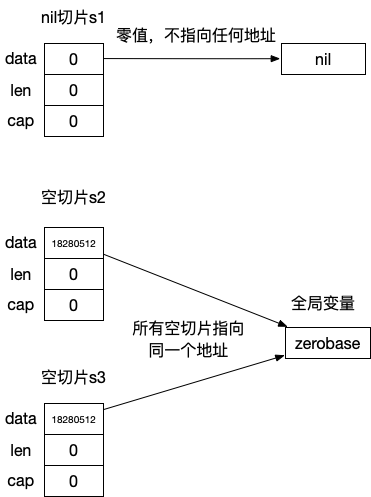

# nil切片和空切片的区别

nil切片和空切片底层数组指向的地址一样吗？

不一样，nil切片的底层数组指针也是nil，而长度为0的空切片的底层数组指针是有地址的，指向一个特殊的全局变量 `runtime.zerobase` 的地址(uintptr类型)。



上图的测试代码：
```go
func main() {  
   var s1 []int            // nil 切片
   s2 := make([]int, 0)    // 空切片，长度和cap都是0
   s3 := make([]int, 0)    // 同样是空切片
  
   fmt.Println((*reflect.SliceHeader)(unsafe.Pointer(&s1)))  
   fmt.Println((*reflect.SliceHeader)(unsafe.Pointer(&s2)))  
   fmt.Println((*reflect.SliceHeader)(unsafe.Pointer(&s3)))  
}
```

输出：

```bash
&{0 0 0}
&{18280512 0 0}
&{18280512 0 0}
```

从slice源码中，我们可以看到空切片的底层数组指针指向了全局变量 zerobase 的地址：

```go
// ------ runtime/slice.go

func makeslice(et *_type, len, cap int) unsafe.Pointer {  
   mem, overflow := math.MulUintptr(et.size, uintptr(cap))  
   if overflow || mem > maxAlloc || len < 0 || len > cap {  
      if overflow || mem > maxAlloc || len < 0 {  
         panicmakeslicelen()  
      }  
      panicmakeslicecap()  
   }  
   // mem是0，故 malloccgc直接返回来 zerobase 的地址
   return mallocgc(mem, et, true)  
}

// ------ runtime/malloc.go

// base address for all 0-byte allocations  
var zerobase uintptr

func mallocgc(size uintptr, typ *_type, needzero bool) unsafe.Pointer {  
   // ...
   if size == 0 {  
      return unsafe.Pointer(&zerobase)  
   }
   // ...
}
```


